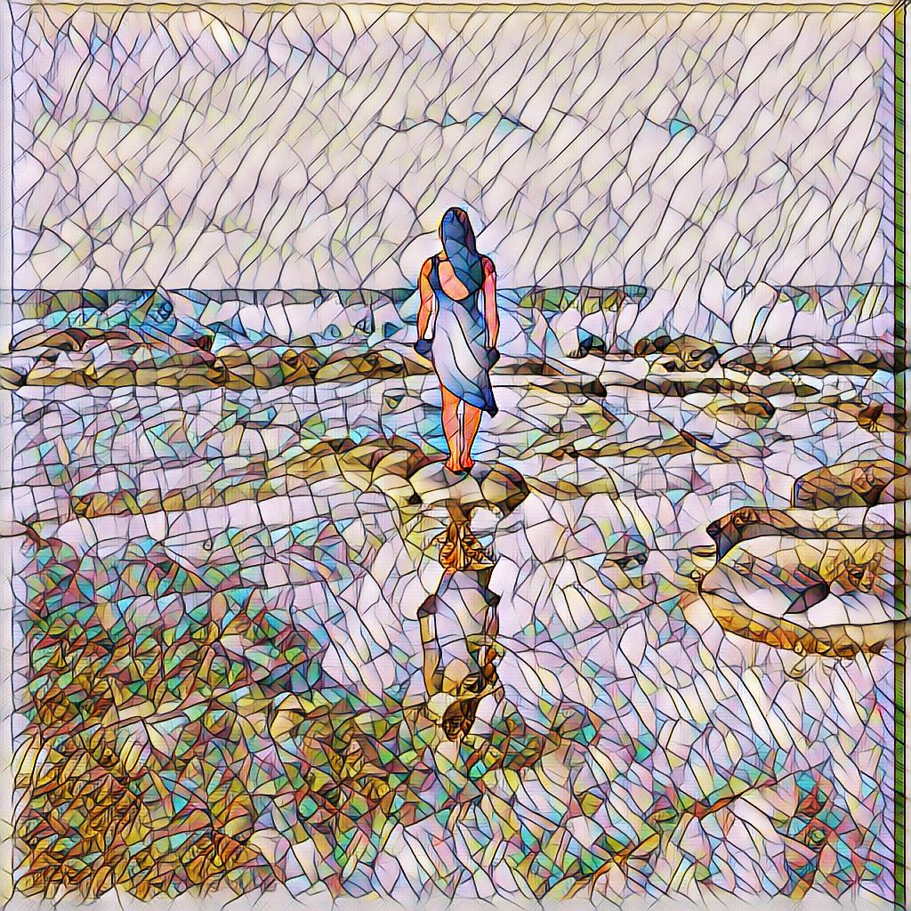
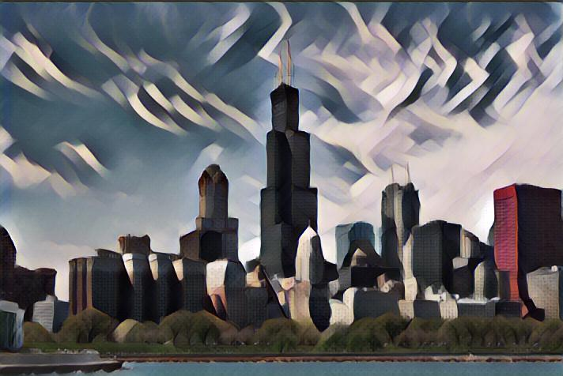

# Fast Style Transfer in Tensorflow 2 
An implementation of fast style transfer, using Tensorflow 2 and many of the tooling native to it.

## Dataset
### Content Images
The COCO 2014 dataset was used for content images, which can be found [here](http://msvocds.blob.core.windows.net/coco2014/train2014.zip). 
### Style
Several style iamges are included in this repository. Please note that some 
images are preprocesse/cropped from the original artwork to abstract certain details.

## Results
Results after 2 epochs. All of these samples were trained with the default hyperparameters and can be tuned accordingly.

## Running the code
Please note, this is not intended to be run on a local machine.
With the availability of cloud notebooks, development was on a Colab instance, which can be viewed [here](https://colab.research.google.com/drive/1xp_QU6ppXOoTs4vNcL41QJk0uz_OOP01).
Training time for 2 epochs was about 4 hours on a Colab instance with a GPU.

## References
