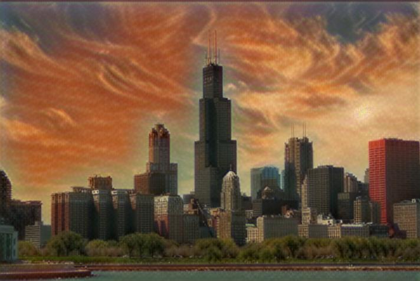
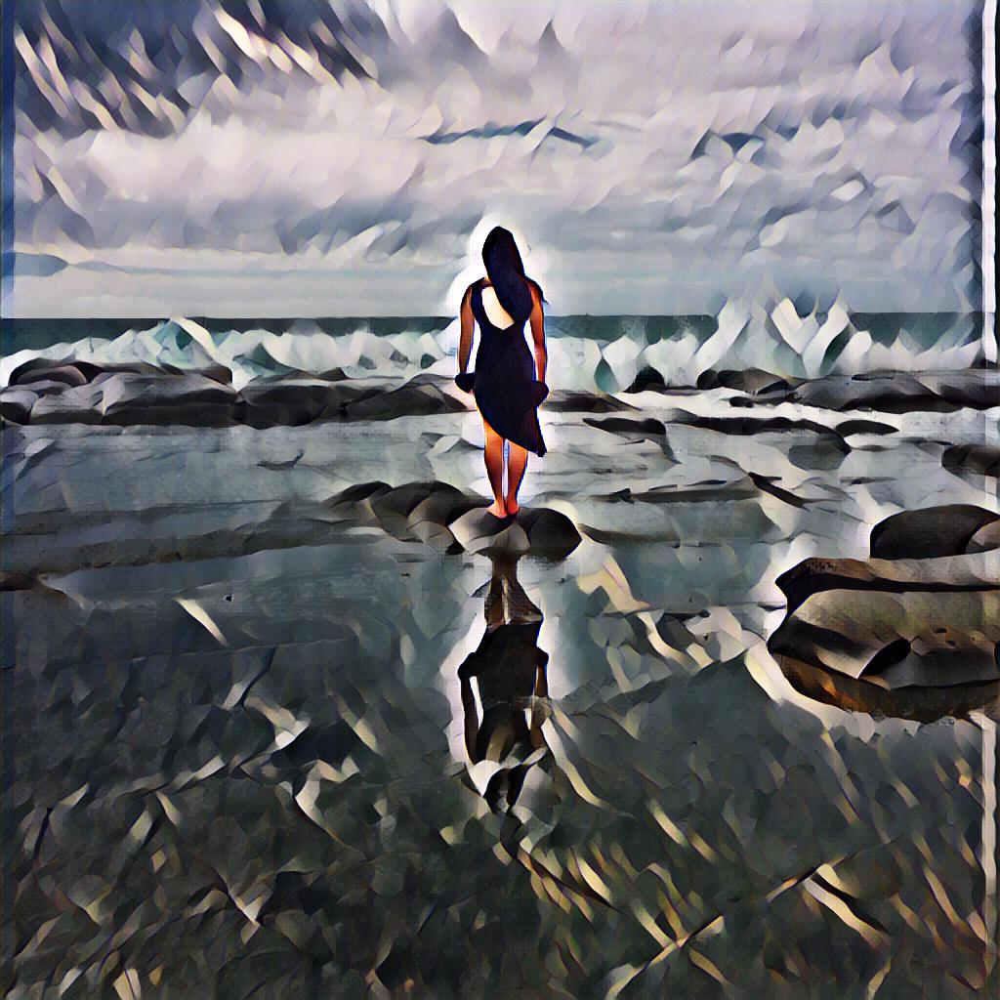
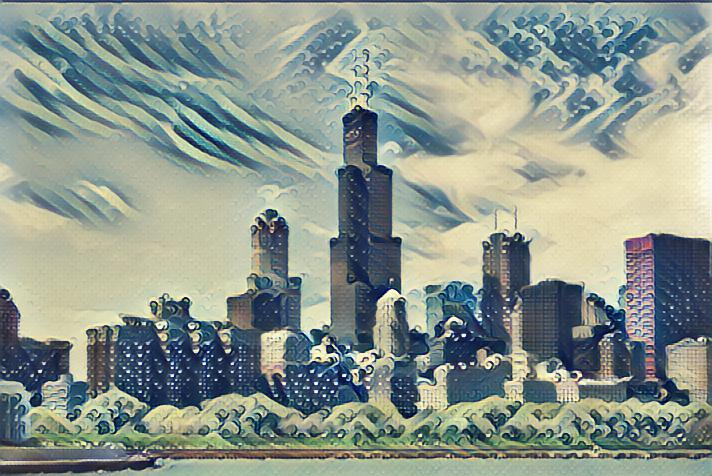
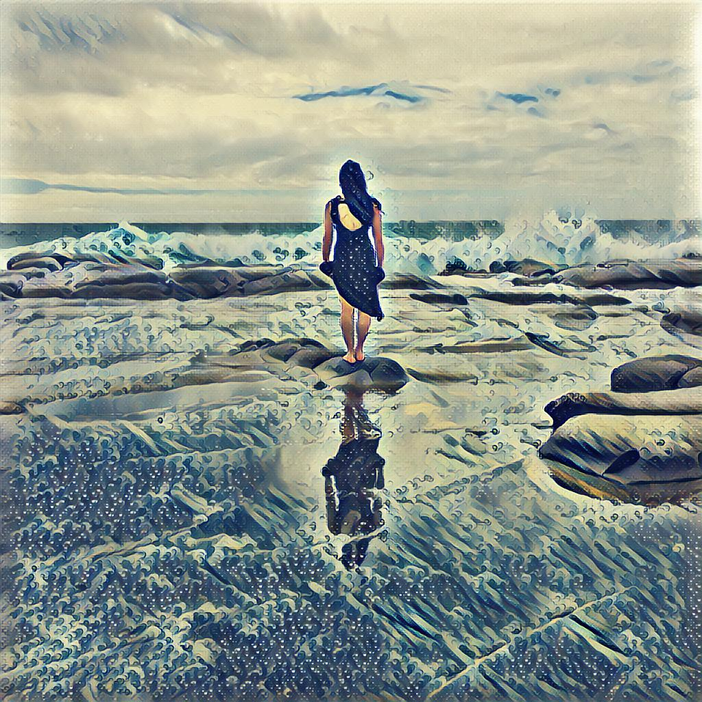

# Fast Style Transfer in Tensorflow 2 
An implementation of fast style transfer, using Tensorflow 2 and many of the toolings native to it and TensorFlow Add Ons.

## Dataset
### Content Images
The COCO 2014 dataset was used for content images, which can be found 
[here](http://msvocds.blob.core.windows.net/coco2014/train2014.zip). 
### Style
Several style images are included in this repository. Please note that some 
images are preprocessed/cropped from the original artwork to abstract certain details.

## Results
Results after 2 epochs. All of these samples were trained with the default hyper-parameters and can be tuned accordingly.

<div align='center'>


</div>
<div align='center'>


</div>
<div align='center'>



</div>
<div align='center'>



</div>
<div align='center'>



</div>

## Running the code
Please note, this is not intended to be run on a local machine.
With the availability of cloud notebooks, development was on a Colab runtime, which can be viewed 
[here](https://colab.research.google.com/drive/1xp_QU6ppXOoTs4vNcL41QJk0uz_OOP01#scrollTo=XM1bqoGdgCbX&forceEdit=true&sandboxMode=true).
Training time for 2 epochs was about 4 hours on a Colab instance with a GPU.

## References
These are previous implementations that in Lau and TensorFlow that were referenced in migrating to TF2. 
Many thanks to their work.  
* Justin Johnson, et al. 2016, [Perceptual Losses for Real-Time Style Transfer
and Super-Resolution](https://cs.stanford.edu/people/jcjohns/papers/eccv16/JohnsonECCV16.pdf), 
[GitHub](https://github.com/jcjohnson/fast-neural-style)
```
@inproceedings{Johnson2016Perceptual,
  title={Perceptual losses for real-time style transfer and super-resolution},
  author={Johnson, Justin and Alahi, Alexandre and Fei-Fei, Li},
  booktitle={European Conference on Computer Vision},
  year={2016}
}
```
* Logan Engstrom, [GitHub](https://github.com/lengstrom/fast-style-transfer) 
```
  @misc{engstrom2016faststyletransfer,
    author = {Logan Engstrom},
    title = {Fast Style Transfer},
    year = {2016},
    howpublished = {\url{https://github.com/lengstrom/fast-style-transfer/}},
    note = {commit xxxxxxx}
  }
```
* hwalsuklee, [GitHub](https://github.com/hwalsuklee/tensorflow-fast-style-transfer)